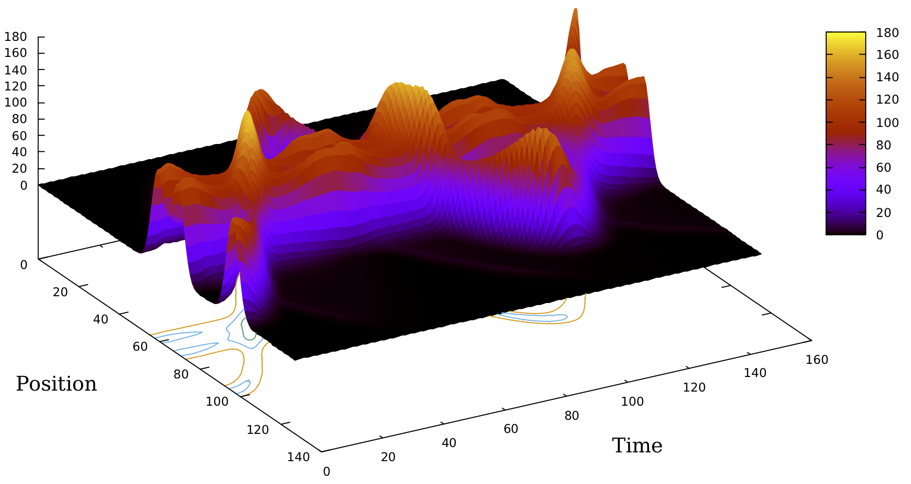

# Schrodinger-equation-solver
Time dependent Schrödinger equation is solved for arbitrary potentials up to 3 degrees of freedom using the Trotter decomposition of the unitary time evolution operator. Files include implementations in C and Matlab.

[*Back to homepage*](https://dgoekmen.github.io)
